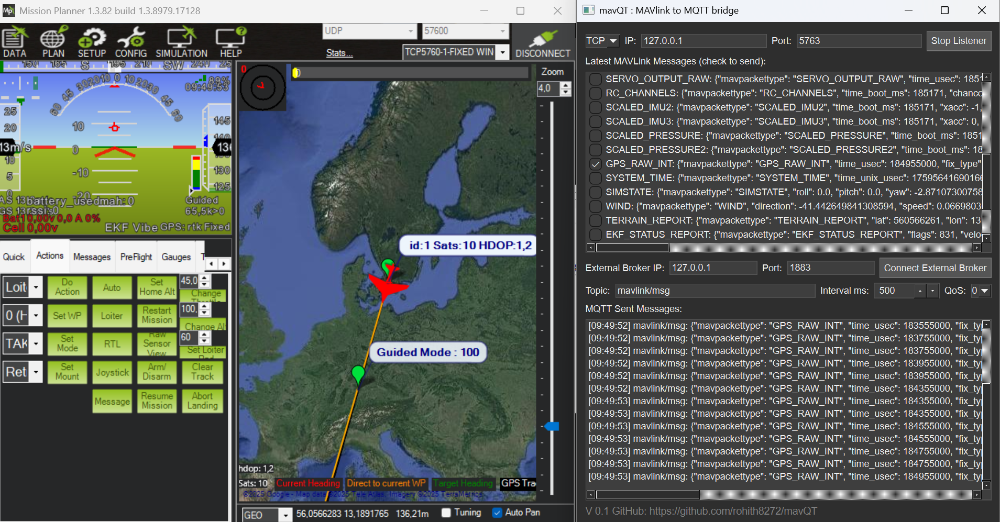
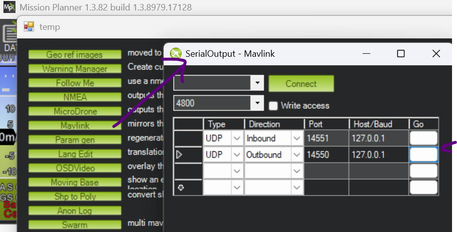

# 🛰️ mavQT

**mavQT** is a lightweight Python tool that connects **MAVLink-enabled drones** to **IoT systems** via **MQTT**.  
It allows you to **receive, display, and forward MAVLink messages in real time** to an MQTT broker, enabling seamless data streaming to cloud and edge devices.



---

### Features

- Connect to **UDP/TCP MAVLink streams** from drones  
- Forward MAVLink messages to any **MQTT broker**  
- Subscribe and publish MQTT topics with custom **QoS levels**  
- Lightweight and easy to integrate into existing UAV systems  

---

### Installation and Setup

1. **Clone the repository:**
   ```bash
   git clone https://github.com/rohith8272/mavQT.git
   cd mavQT
   ```

2. **Create a virtual environment and install dependencies:**
   ```bash
   python -m venv venv
   source venv/bin/activate   # On Windows: venv\Scripts\activate
   pip install -r requirements.txt
   ```

3. **Run the tool:**
   ```bash
   python -m mavQT
   ```

---

### Setting Up an MQTT Broker

Before running **mavQT**, ensure that an MQTT broker is available to receive MAVLink packets.

### Option 1: Run a Local Broker (Mosquitto)

1. **Download Mosquitto:**  
   [https://mosquitto.org/download/](https://mosquitto.org/download/)

2. **Navigate** to the Mosquitto installation directory where `mosquitto.exe` is located.

3. **Create a configuration file** named `sample.conf` with the following contents:
   ```conf
   # Default listener (local + remote)
   listener 1883 0.0.0.0

   # Allow anonymous connections 
   allow_anonymous true

   # (Optional) persistence
   persistence true
   persistence_location mosquitto/
   ```

4. **Start the broker:**
   ```bash
   mosquitto.exe -c "sample.conf" -v
   ```
   The broker should now be running on **port 1883**.

### Option 2: Use an Online Broker

If you prefer not to run a local broker, you can use a free online MQTT service like:

- [Eclipse Mosquitto Test Server](https://test.mosquitto.org)
- [HiveMQ Public Broker](https://www.hivemq.com/public-mqtt-broker/)

---

### Forwarding MAVLink Streams

To connect your MAVLink stream to **mavQT**, ensure your flight controller or GCS is sending data to the correct UDP/TCP port.
If you haven't set up Software in the Loop(SITL) simulations before, you can use: [https://dronesim.xyz/](https://dronesim.xyz/)

#### Example 1: Using Mission Planner
- Set **UDP outbound** on port **14550**.


#### Example 2: Using MAVProxy
```bash
mavproxy --master=tcp:127.0.0.1:5760 --out 127.0.0.1:14550
```

For more information on MAVLink routing, check the DroneSim documentation:  
[Forwarding MAVLink Packets](https://dronesim.gitbook.io/dronesim-docs/development-tutorials/forwarding-mavlink-packets)

---

### Testing mavQT

1. Connect **mavQT** to your MQTT broker using its **IP** and **port**.  
2. Subscribe to or publish MQTT topics to view real-time MAVLink data.  
3. Adjust **QoS levels** as needed for reliable message delivery.  

Example usage:
```bash
python -m mavQT
```
On connection to an active MAVLink stream, new messages are auto discovered. I can now check the messages that I would like to broadcast with the custom topic name (default mavlink/msg). The bottom terminal should now show the client topics. You can also recieve the topics on any device with an mqtt client within the network or using a VPN.

The MAVLink packets are sent as soon as they are received by the tool, while it is also possible to set a time interval and QoS level. 

---

### Contribute
The current tool is a PoC and you are free to modify and alter it to your requirements.
If you’d like to improve **mavQT**, report bugs, or suggest features, feel free to open an issue or submit a pull request.

📍 Repository: [https://github.com/rohith8272/mavQT](https://github.com/rohith8272/mavQT)

---

### Reference

- [MAVLink Protocol Documentation](https://mavlink.io/en/)
- [MQTT Introduction](https://mqtt.org/getting-started/)
- [DroneSim Project](https://dronesim.xyz)

---


