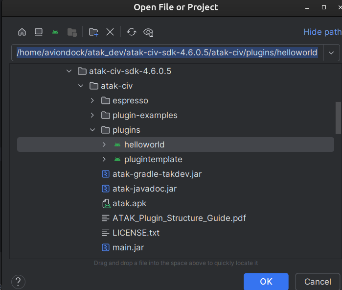
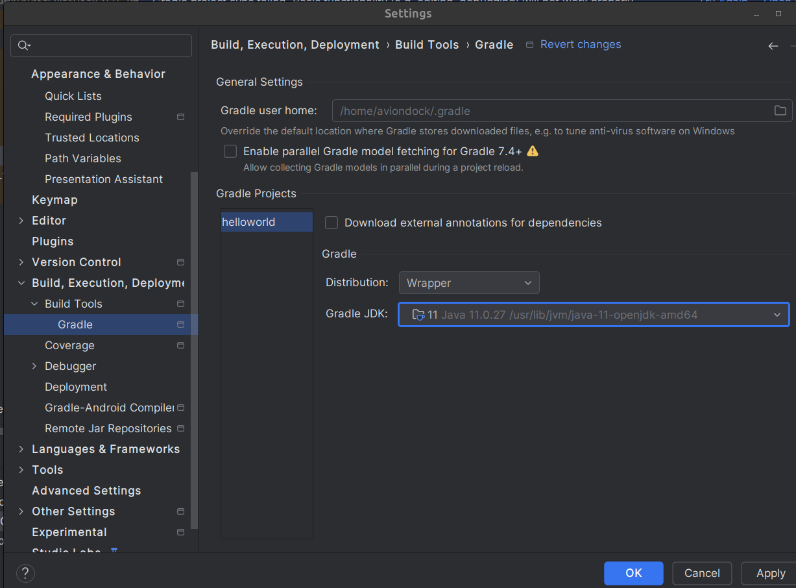
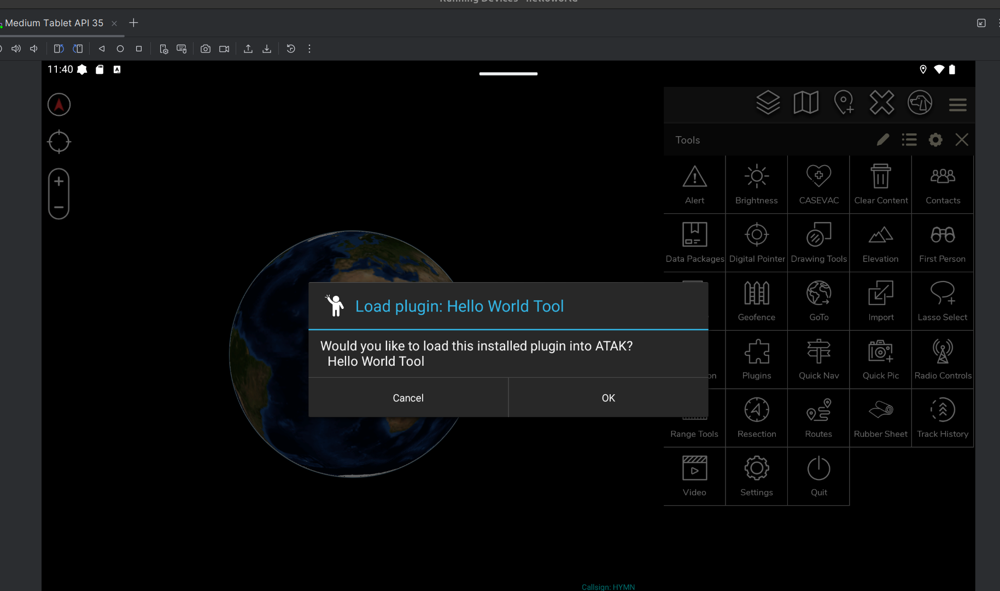
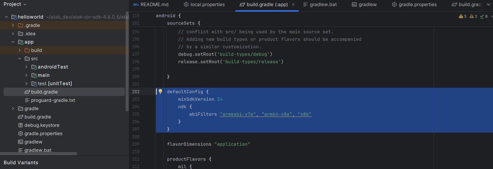

This short guide walks through the minimal steps to build and install a simple **HelloWorld** ATAK 
plugin using the **ATAK-CIV SDK**. It assumes you have a working development machine and some basic Android Studio experience.

## Requirements

Before starting, make sure you have:

**Android Studio** (latest stable version)  
[Download from developer.android.com/studio](https://developer.android.com/studio)  
**Android SDK Platform 21** (Android 5.0 / Lollipop)  
ATAK requires **API level 21** or higher.  
**ATAK-CIV SDK**  
[GitHub – deptofdefense/AndroidTacticalAssaultKit-CIV](https://github.com/deptofdefense/AndroidTacticalAssaultKit-CIV)


## 1. Install Android Studio

Download and install Android Studio using the default installer for your OS.  
Then open the **SDK Manager** and ensure that **API level 21** (Android 5.0) is installed.

> 💡 Even if you already have newer SDKs, API 21 is required for ATAK builds.

---

## 2. Clone the ATAK SDK

Clone or download the official ATAK-CIV repository:

```bash
git clone https://github.com/deptofdefense/AndroidTacticalAssaultKit-CIV.git
```
Inside this repo, locate the plugin-examples folder — it includes several working examples, including HelloWorld.

## 3. Copy the HelloWorld Example

Copy the helloworld example from the SDK into your working plugins folder, or open it directly in Android Studio.


The HelloWorld plugin is a good starting point because it demonstrates the basic structure of an ATAK plugin project.




## 4. Generate a Signing Key (Keystore)

ATAK plugins must be signed before installation.
Create a debug keystore using the keytool command (included with the JDK):

```bash
keytool -genkeypair \
  -alias androiddebugkey \
  -keyalg RSA \
  -keysize 2048 \
  -validity 9999 \
  -keystore debug.keystore \
  -storepass android \
  -keypass android \
  -dname "CN=Android Debug,O=Android,C=US"
```

## 5. Update the key locations
Update local.properties file

```bash
sdk.dir=/home/aviondock/Android/Sdk
takDebugKeyFile=<your location>/plugins/helloworld/debug.keystore
takDebugKeyFilePassword=android
takDebugAlias=androiddebugkey
takDebugKeyPassword=android

takReleaseKeyFile=<your location>/plugins/helloworld/release.keystore
takReleaseKeyFilePassword=android
takReleaseAlias=androidreleasekey
takDebugKeyPassword=android
```

## 6.Versions for gradle

Open the `<PLUGIN-NAME>/app/build.gradle` file by set the Project Files view to “Project”, expand the app directory and click the `build.gradle` file. On line 16 there should be a line of code that we need to change since the def function is not properly scoped to be used later in the build script.

```
// app/build.gradle
// Original function signature
def getValueFromPropertiesFile = { propFile, key ->

// New function signature
ext.getValueFromPropertiesFile = { propFile, key ->
```
Under prject structure set the following versions:

Go to "File > Settings > Build, Execution, Deployment > Build Tools > Gradle > Gradle JDK" and make sure you are using Java 11, if you don't have it, install it. Sync project with gradle files with all the changes that we did and update the file configuration.



## 7. Select the Correct Build Variant

In Android Studio, open the Build Variants panel (bottom-left corner). Select the variant civDebug — this matches the developer ATAK build shipped in the SDK. Sync gradle and assemble plugin run configuration(hammer icon)


## 8. Test the plugin

Now we ready to run and test out the plugin!
Create Virtual Device. Go to Tools—> device manager→ create virtual device. You can now drag and drop both the developer ATAK apk and the hellow world plugin apk on the device.




## Notes
1. The **Google Play version** of ATAK **does not load custom plugins**.  
To test your plugin, use the **developer ATAK APK** included in the **ATAK SDK** instead.

2. **Installation on a Tablet** If you have a tablet available:
Send both .apk files (the ATAK developer build and your plugin).
Install them in order — ATAK first, then your plugin.


3. Check for errors in the terminal using:
```bash
adb logcat | grep -i "helloworld"
```

4. I had to change the android apk version here:



5. Add maps by loading data packages:  drag and drop the zip files from here: https://github.com/joshuafuller/ATAK-Maps

6. Here is the original tutorial I used to setup my plugin:
   [link](https://www.riis.com/blog/atak-plugins-part-1)

---

[^1]:MAVLink Protocol Documentation, https://mavlink.io/en/
[^2]:MQTT Introduction, (https://mqtt.org/getting-started/)
[^3]:DroneSim Project, (https://dronesim.xyz)
