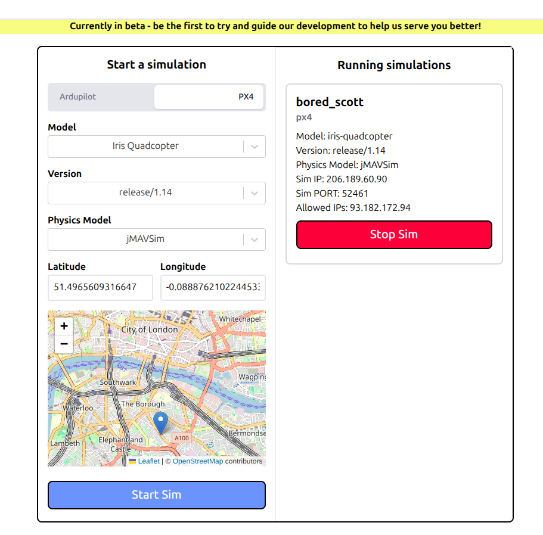

## Installation and Setup


1. **Clone the repository[^1]:**
   ```bash
   git clone https://github.com/mavlink/qgroundcontrol.git
   cd qgroundcontrol
   ```

2. **Docker setup**
   We will use the docker container[^4] that has the complete environment already setup for us.
   ```bash
         docker run --rm \
      --device /dev/fuse \
      --cap-add SYS_ADMIN \
      --security-opt apparmor:unconfined \
      -v ${PWD}:/project/source \
      -v ${PWD}/build:/project/build \
      qgc-ubuntu-docker
   ```
   
If everything is installed correctly, QgroundControl application can now be run from the build 
folder. 

```bash
~/Downloads/qgroundcontrol/build$ ./Custom-QGroundControl-x86_64.AppImage
```


### QGC Plugin 
The `custom-example` folder demonstrates how to transform standard QGroundControl (QGC) into a proprietary product for your specific drone.
Instead of hacking the core QGC code (which makes updates difficult), you create a "Custom Build" that sits on top of the core.
On inspecting the file directory, you will see a example plugin folder.

The `CMakeLists.txt` file is already set up to compile these custom files. To build this example:
1. **Rename** the folder `custom-example` to `custom`
2. **Clean** your build directory.
3. build QGroundControl using the docker command.


## Adding a custom widget

Let us add a custom widget to access vehicle pararmeters and log it to the console.
For this walkthrough we will only be needing to modify the following files:

### Layout
**FlyViewCustomLayer.qml**

This QML file defines a **Custom Overlay** for the QGroundControl "Fly View." Think of it as a transparent 
sheet of glass placed over the map where you draw your own instruments (like compasses and gauges).


For the parameter widget, add the following code block that defines the bottom left positioning in the FlyView UI.

```javascript
CustomParameterWidget {
    id: paramWidget
    visible: true

    anchors.left: parent.left
    anchors.top: mapMarkerWidget.bottom
    anchors.leftMargin: _toolsMargin
    anchors.topMargin: 2*parentToolInsets.topEdgeLeftInset 

    property real leftEdgeCenterInset: visible ? x + width : 0
}
```

### Logic

**CustomVehicleParamWidget.qml**

Create a new qml file in `qgroundcontrol/custom/res/Custom/Widgets` folder. Here we define the widget UI and logic for accessing the parameters. When working with large codebase such as QGC, I found
codewiki[^2] quiet powerful to search through codebase and quickly find the required classes and dependencies.


In QGroundControl, all parameters and settings are handled as **"Facts."** A Fact is a smart wrapper around a value that also knows what the value means, how it should be displayed, and how it can be edited.

Facts are built to work directly with QML:
- UI elements bind directly to Fact values
- Changes update automatically
- Sliders, dropdowns, and text fields validate themselves

Related parameters are organized into **FactGroups**, and dynamic sets use **FactGroupWithId**.
The `logSingleParameter()` function demonstrates how to retrieve and inspect a parameter as a Fact.


- **ParameterManager** - handles loading and writing parameters to the vehicle over MAVLink
- **FactPanelController** - the main bridge for widgets, allowing QML code to safely access Facts
- **SettingsFact** - stores application settings persistently

```javascript
function logSingleParameter(paramName) {
    var fact = null
    var foundComponent = -1
    
    if (factPanelController.parameterExists(-1, paramName)) {
        fact = factPanelController.getParameterFact(-1, paramName, false)
        foundComponent = -1
    } else {
        var compIds = parameterManager.componentIds()
        for (var i = 0; i < compIds.length; i++) {
            if (factPanelController.parameterExists(compIds[i], paramName)) {
                fact = factPanelController.getParameterFact(compIds[i], paramName, false)
                foundComponent = compIds[i]
                break
            }
        }
    }
    
    if (!fact) {
        console.log(paramName, "not found")
        return
    }
    ```
    
   Facts maintain both raw (internal storage format) and cooked (user-friendly display format) representations of values. 
   String versions with full precision and display formatting are also available for UI presentation.

    ```javascript
    console.log("✓", paramName, "(component", foundComponent + ")")
    console.log("  Name:", fact.name)
    console.log("  Short Description:", fact.shortDescription)
    console.log("  Type:", fact.type)
    console.log("  Raw Value:", fact.rawValue)
    console.log("  Cooked Value:", fact.value)
    ```

    For parameters with predefined options, Facts provide lists of human-readable labels and their corresponding numeric values. Enums represent single-selection choices, while bitmasks allow multiple flags to be set simultaneously.
    
    ```javascript
    if (fact.enumStrings.length > 0) {
        console.log("  Enum Strings:", fact.enumStrings)
        console.log("  Enum Values:", fact.enumValues)
    } else if (fact.bitmaskStrings.length > 0) {
        console.log("  Bitmask Strings:", fact.bitmaskStrings)
    }
    ```

    ```javascript
    // Validation constraints
    console.log("  Min:", fact.min, "Max:", fact.max)
    console.log("  Units:", fact.units)
    console.log("  Decimal Places:", fact.decimalPlaces)
    
    // Default value info
    if (fact.defaultValueAvailable) {
        console.log("  Default Value:", fact.defaultValue)
        console.log("  Value Equals Default:", fact.valueEqualsDefault)
    }
    ```
    
Behavioral Flags:These flags control how parameters behave in the UI and system. They indicate access permissions (read-only/write-only), whether values may change automatically, and if modifications require restarting the vehicle or QGC application.
```javascript
    console.log("  Read Only:", fact.readOnly)
    console.log("  Vehicle Reboot Required:", fact.vehicleRebootRequired)
}
```

### Build

Add the newly created qml widget to the cmakelist and rebuild the application.

```javascript
${CMAKE_CURRENT_SOURCE_DIR}/res/Custom/Widgets/CustomParameterWidget.qml
```

### Testing with SITL simulation

If you have a local PX4 simulation running, you can connect it to QGroundControl. Alternatively you can use 
the PX4 cloud simulation available on dronesim[^3] with the following settings:



When the "GF_ACTION" parameter is queried, the following output is shown in the console.


My custom plugin repository (https://github.com/rohith8272/QGC-plugin-template) contains other examples such as mavlink data plotting and map interactions.

---

[^1]:QGroundControl, https://qgroundcontrol.com/
[^2]:QGC on codewiki, (https://codewiki.google/github.com/mavlink/qgroundcontrol)
[^3]:DroneSim Project,(https://dronesim.xyz)
[^4]:https://docs.qgroundcontrol.com/master/en/qgc-dev-guide/getting_started/container.html
[^5]:https://docs.qgroundcontrol.com/master/en/qgc-dev-guide/custom_build/custom_build.html